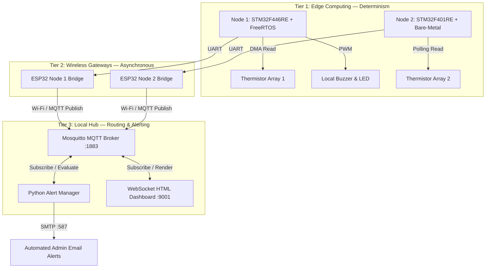
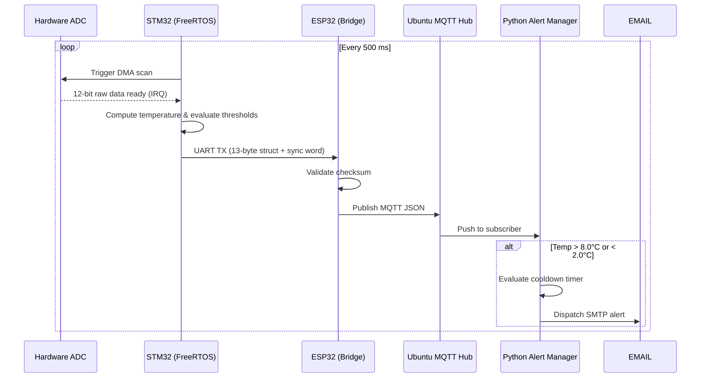

<div align="center">

# 🌡️ Smart Vaccine Cold Chain Monitoring & Alert System

### Enterprise-Grade IoT Architecture Manual

[]()
[]()
[]()
[]()
[]()
[]()

A distributed, fault-tolerant IoT telemetry system engineered to strictly monitor the **2°C – 8°C vaccine cold chain**, built on a multi-node STM32 + FreeRTOS edge layer, bridged through ESP32 wireless gateways, and centrally managed by an MQTT-based local hub with real-time alerting.

[Overview](#-executive-summary) • [Architecture](#-high-level-system-architecture) • [Hardware](#-hardware-bill-of-materials--pinouts) • [Firmware](#-edge-firmware-stm32--freertos-deep-dive) • [Deployment](#-deployment-guide) • [Troubleshooting](#-troubleshooting--ground-loop-prevention)

</div>

---

## 📖 Table of Contents

1. [Executive Summary](#-executive-summary)
2. [High-Level System Architecture](#-high-level-system-architecture)
3. [Hardware Bill of Materials & Pinouts](#-hardware-bill-of-materials--pinouts)
4. [Edge Firmware: STM32 & FreeRTOS Deep Dive](#-edge-firmware-stm32--freertos-deep-dive)
5. [Gateway Firmware: ESP32 UART-to-MQTT Bridge](#-gateway-firmware-esp32-uart-to-mqtt-bridge)
6. [Network Architecture & Hub Configuration](#-network-architecture--hub-configuration)
7. [MQTT Topic Registry & Payload Schemas](#-mqtt-topic-registry--payload-schemas)
8. [Repository Structure](#-repository-structure)
9. [Deployment Guide](#-deployment-guide)
10. [Troubleshooting & Ground Loop Prevention](#-troubleshooting--ground-loop-prevention)
11. [Roadmap](#-roadmap)
12. [Contributing](#-contributing)
13. [License](#-license)
14. [Author & Acknowledgments](#-author--acknowledgments)

---

## 🌍 Executive Summary

### The Problem

Per WHO estimates, a large share of vaccine doses worldwide are lost annually due to **cold chain temperature excursions**. Vaccines and other biologics must remain within a strict **2°C – 8°C** band:

- **Below 2°C** → adjuvants freeze and are permanently destroyed.
- **Above 8°C** → proteins denature and the dose loses efficacy.

Conventional monitoring relies on **passive USB data loggers** that are only reviewed *after* a spoilage event has already occurred — by then, the damage is done and the inventory is unusable.

### The Engineering Solution

This project implements a **proactive, hard real-time, fault-tolerant monitoring system** that separates two concerns:

| Concern | Requirement | Handled By |
|---|---|---|
| Local hardware alarm | Hard real-time, deterministic | STM32 + FreeRTOS (Edge) |
| Network transmission & alerting | Asynchronous, best-effort | ESP32 + MQTT + Python (Cloud/Hub) |

This separation guarantees that **network latency or Wi-Fi dropouts can never delay or suppress a local hardware alarm** — clinic staff are alerted to an excursion at the device itself, independent of connectivity.

---

## 🚀 High-Level System Architecture

The system follows a decoupled **three-tier architecture**: Edge, Gateway, and Hub.



### Telemetry Sequence



---

## 🔌 Hardware Bill of Materials & Pinouts

### Component List

| Qty | Component | Role |
|---|---|---|
| 1× | NUCLEO-F446RE | Node 1 — Primary edge controller |
| 1× | NUCLEO-F401RE | Node 2 — Secondary edge controller |
| 2× | ESP32-WROOM-32 Dev Board | Wireless UART-to-MQTT gateways |
| 4× | 10 kΩ Potentiometer | Simulated NTC thermistors |
| 1× | Active Piezo Buzzer | Local hardware alarm |
| 1× | Ubuntu Linux Machine | Local MQTT broker / hub |

### Node 1 Wiring — F446RE → ESP32

| F446RE Pin | Peripheral | Direction | ESP32 Pin | Purpose |
|---|---|:---:|---|---|
| `PA0` | ADC1_IN0 | ← | Potentiometer 1 | Inner vaccine compartment temp |
| `PA1` | ADC1_IN1 | ← | Potentiometer 2 | Ambient/surrounding temp |
| `PA8` | TIM1_CH1 | → | Buzzer (+) | PWM hardware alarm trigger |
| `PA9` | USART1_TX | → | Pin 16 (RX2) | TX 13-byte sensor struct |
| `GND` | Ground | — | GND | **Critical — common logic reference** |

### Node 2 Wiring — F401RE → ESP32

| F401RE Pin | Peripheral | Direction | ESP32 Pin | Purpose |
|---|---|:---:|---|---|
| `PA0` | ADC1_IN0 | ← | Potentiometer 1 | Inner vaccine compartment temp |
| `PA1` | ADC1_IN1 | ← | Potentiometer 2 | Ambient/surrounding temp |
| `PC6` | USART6_TX | → | Pin 16 (RX2) | TX 13-byte sensor struct |
| `GND` | Ground | — | GND | **Critical — common logic reference** |

> ⚠️ **Power Warning:** The ESP32 can draw up to 500 mA during Wi-Fi transmission bursts. **Never** power the ESP32 from the STM32's 3V3 or 5V rail — this will damage the STM32's onboard LDO regulator. Power both boards from independent USB sources.

---

## 🧠 Edge Firmware: STM32 & FreeRTOS Deep Dive

Node 1 runs an optimized FreeRTOS task architecture designed so that no single task can starve the CPU or delay the alarm path.

### 1. Synchronization Primitives

Rather than polling the ADC and wasting CPU cycles, the firmware uses **Direct Memory Access (DMA)**:

- The ADC scans both analog channels entirely in the background.
- On scan completion, the DMA interrupt releases a **binary semaphore** (`Sem_DMA_Ready`).
- `Task_Logic` — blocked on `osWaitForever` — wakes instantly the moment the semaphore is released, with microsecond-level latency.

### 2. Memory-Mapped Sensor Struct

To avoid the overhead of `sprintf` and JSON serialization at the edge, telemetry is packed into a fixed-size binary struct:

```c
typedef struct __attribute__((packed)) {
    uint16_t sync_header;  // 0xAABB — prevents frame shifting
    float    inner_temp;   // IEEE 754 float
    float    surr_temp;    // IEEE 754 float
    uint8_t  alert_inner;  // Boolean flag
    uint8_t  alert_surr;   // Boolean flag
    uint8_t  checksum;     // Sum of preceding 12 bytes
} SensorPacket_t;
```

`__attribute__((packed))` instructs the ARM GCC compiler to omit padding bytes, guaranteeing the packet is **exactly 13 bytes** on the wire — a strict contract the ESP32 parser relies on.

### 3. Asynchronous Alarm Handling

On excursion detection, `Task_Logic` sets an **OS event flag**. `Task_Buzzer`, listening for that flag on its own thread, generates alternating PWM pulse patterns via `osDelay()` — entirely decoupled from the sensor sampling loop, so the alarm tone never blocks or is blocked by data acquisition.

---

## 📡 Gateway Firmware: ESP32 UART-to-MQTT Bridge

The ESP32 acts purely as a translation layer, running a small state machine that hunts for the `0xAABB` sync word.

### Frame Alignment & Integrity

Raw binary UART is vulnerable to dropped bytes from electrical noise. If the ESP32 blindly read 13 bytes per frame, a single dropped byte would permanently shift the data window, corrupting every subsequent float read as garbage.

The bridge defends against this in two layers:

1. **Sync detection** — only accepts a frame once `sync_header == 0xAABB` is found, guaranteeing byte alignment.
2. **Checksum validation** — recomputes the checksum on receipt; if it doesn't match `rx_packet.checksum`, the frame is silently dropped and the UART RX buffer is flushed.

This guarantees **zero corrupted telemetry** ever reaches the MQTT broker.

---

## 🌐 Network Architecture & Hub Configuration

### The AP-Isolation Problem

Most IoT tutorials assume devices publish to a public cloud broker (e.g., HiveMQ). In practice, enterprise and campus Wi-Fi (WPA2-Enterprise) frequently enforces **client/AP isolation**, where devices on the same network cannot reach each other directly.

### The Solution — Localized Mosquitto Broker

This system deploys an Ubuntu machine as a self-hosted hub:

- All ESP32 gateways and the Python alert manager route traffic to one fixed local IP (e.g., `10.172.99.147`).
- `ufw` is explicitly configured to allow:
  - **TCP 1883** — raw MQTT
  - **TCP 9001** — MQTT over WebSockets (for the live dashboard)

---

## 📊 MQTT Topic Registry & Payload Schemas

Telemetry is published at **QoS 0** (at-most-once delivery) to prioritize low latency over guaranteed delivery — appropriate for high-frequency (2 Hz) sensor streams where the next reading supersedes the last.

| Topic | Publisher | Subscriber(s) | Description |
|---|---|---|---|
| `factory/node1/sensors` | ESP32 Node 1 | Python, Dashboard | Node 1 telemetry stream |
| `factory/node2/sensors` | ESP32 Node 2 | Python, Dashboard | Node 2 telemetry stream |

**Standard JSON Payload:**

```json
{
  "inner_temp": 4.5,
  "surr_temp": 22.1,
  "alert_inner": 0,
  "alert_surr": 0
}
```

| Field | Type | Description |
|---|---|---|
| `inner_temp` | float | Inner vaccine compartment temperature (°C) |
| `surr_temp` | float | Surrounding/ambient temperature (°C) |
| `alert_inner` | bool (0/1) | Inner compartment out of 2–8°C band |
| `alert_surr` | bool (0/1) | Ambient sensor out of acceptable range |

---

## 📁 Repository Structure

```text
.
├── firmware/
│   ├── node1_stm32f446re/      # FreeRTOS edge firmware, Node 1
│   └── node2_stm32f401re/      # Bare-metal edge firmware, Node 2
├── gateway/
│   ├── node1_iot/               # ESP32 UART-to-MQTT bridge, Node 1
│   └── node2_iot/               # ESP32 UART-to-MQTT bridge, Node 2
├── hub/
│   ├── main.py                  # Python MQTT subscriber & alert manager
│   ├── dashboard/                # WebSocket-driven HTML/JS live dashboard
│   └── mosquitto.conf            # Broker configuration reference
└── README.md
```

---

## 💻 Deployment Guide

### Phase 1 — Toolchain Installation

| Tool | Purpose |
|---|---|
| [STM32CubeIDE](https://www.st.com/en/development-tools/stm32cubeide.html) | Compile & flash STM32 (Cortex-M4) firmware |
| [Arduino IDE](https://www.arduino.cc/en/software) + ESP32 board package | Compile & flash ESP32 gateway firmware |
| Ubuntu 20.04+ | Hosts the MQTT broker and Python alert manager |

On the Ubuntu hub, install dependencies:

```bash
sudo apt update
sudo apt install mosquitto mosquitto-clients python3 python3-pip
pip3 install paho-mqtt
```

### Phase 2 — Broker Configuration

Enable WebSocket support so the dashboard can connect directly to the broker:

```bash
sudo nano /etc/mosquitto/mosquitto.conf
```

Append:

```text
listener 1883
protocol mqtt
allow_anonymous true

listener 9001
protocol websockets
```

Restart the service:

```bash
sudo systemctl restart mosquitto
```

### Phase 3 — Flash the Hardware

1. Open `firmware/node1_stm32f446re/` in STM32CubeIDE → **Build** → **Run** to flash Node 1.
2. Repeat for `firmware/node2_stm32f401re/` to flash Node 2.
3. Open `gateway/node1_iot/node1_iot.ino` in Arduino IDE. Update `ssid`, `password`, and `mqtt_server` to match your network and hub IP. Flash to the ESP32. Repeat for Node 2.

### Phase 4 — Launch the Command Center

From the hub directory on the Ubuntu machine:

```bash
python3 main.py
```

Open `http://localhost:8000` in a browser to view live, auto-updating telemetry cards for both nodes.

---

## 🛠️ Troubleshooting & Ground Loop Prevention

<details>
<summary><b>ESP32 prints "Attempting MQTT Connection..." but never connects</b></summary>

- Your Ubuntu firewall may be blocking the broker port: `sudo ufw allow 1883/tcp`
- Confirm the ESP32 and the hub are on the **same 2.4 GHz band** — ESP32 does not support 5 GHz Wi-Fi.

</details>

<details>
<summary><b>ESP32 connects to MQTT, but no data arrives from the STM32</b></summary>

- **Ground loop / floating reference:** a physical wire must connect STM32 `GND` to ESP32 `GND`.
- **TX/RX crossover:** confirm STM32 `TX` → ESP32 `RX`. TX-to-TX wiring will produce no data.

</details>

<details>
<summary><b>Dashboard shows "Connecting..." indefinitely</b></summary>

- Confirm `mosquitto.conf` has the WebSocket listener on port `9001` and the service was restarted.
- Check the browser console (F12) for `WebSocket connection refused` errors.

</details>

---

## 🗺️ Roadmap

- [ ] Replace simulated potentiometers with real NTC/DS18B20 thermistor probes
- [ ] Add TLS-secured MQTT (port 8883) for production deployments
- [ ] Persist telemetry history to a time-series database (InfluxDB/TimescaleDB)
- [ ] Mobile push notifications alongside SMTP alerts
- [ ] OTA firmware updates for the ESP32 gateways

---

## 🤝 Contributing

Contributions, issues, and feature requests are welcome.

1. Fork the repository
2. Create a feature branch (`git checkout -b feature/your-feature`)
3. Commit your changes (`git commit -m 'Add some feature'`)
4. Push to the branch (`git push origin feature/your-feature`)
5. Open a Pull Request

---

## 📄 License

This project is licensed under the **MIT License** — see the [LICENSE](LICENSE) file for details.

---

## 👤 Author & Acknowledgments

**Architected and engineered by Aravindhan TV**

Final-year B.Tech Electronics & Communication Engineering student, focused on embedded systems, firmware, and IoT architecture.
